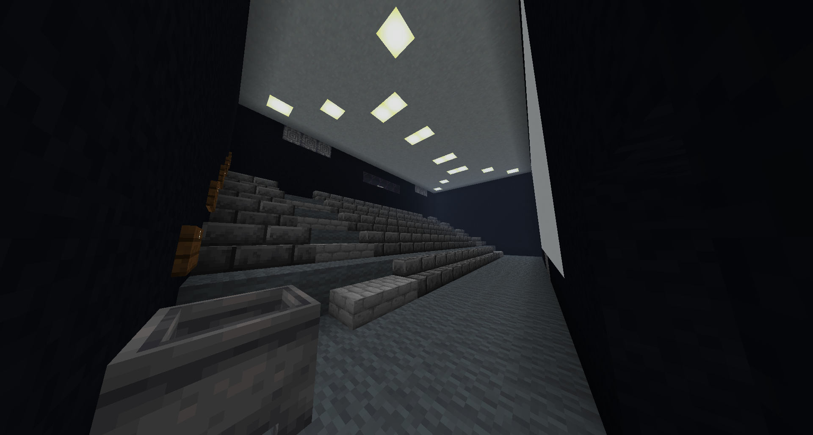

# Hub 1

## Connections
* <a href="../levels/Level_1.md">Level 1</a>
* <a href="../levels/Level_2.md">Level 2</a>
* <a href="../levels/Level_3.md">Level 3</a>
* <a href="../levels/Level_4.md">Level 4</a>
* <a href="../levels/Level_8.md">Level 10</a>

## Entrances
* Entering a portal at `X: -221 Z: 324` on level <a href="../Level_1.md">Level 1</a>.
* Entering a portal at `X: 112 Z: -55` on level <a href="../Level_2.md">Level 2</a>.
* Entering a portal at `X: -862 Z: -254` on level <a href="../Level_3.md">Level 3</a>.
* Entering a portal at `X: 1137 Z: -1161` on level <a href="../Level_4.md">Level 4</a>.
* Entering a portal at `X: -553 Z: -889` on level <a href="../Level_10.md">Level 10</a>.

<a href="./Hub_0.md">< [Hub 0]</a> | <a href="./Hubs.md">Hub List</a>