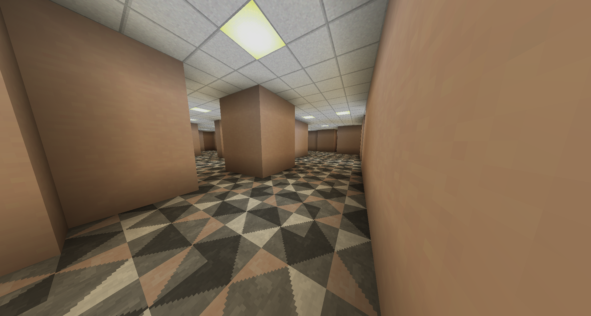
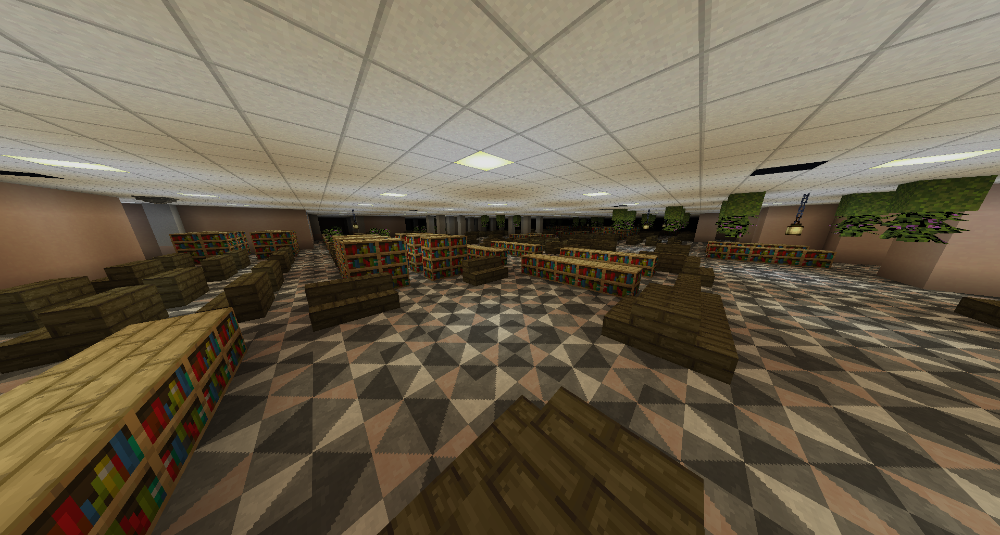

# Level 10: Hall

## Description
Many hallways, some hallways contain bookshelfs. There has been a confirmed sighting of a smiler. 

## Entities
You can find <a href="../entities/Entity_1.md">Smilers</a> here sometimes. 
You might find beehives, don't go near them as they will spawn house spiders that are extremely dangerous.

## Entrances
* Noclipping out of <a href="./Level_9.md">Level 9</a>.

## Exits
* Entering an end gateway portal will lead to <a href="./Level_11.md">Level 11</a>.
* Entering a portal at `X: -553 Z: -889` may lead to <a href="../hubs/Hub_1.md">Hub 1</a>.

<a href="./Level_9.md">< [Level 9]</a> | <a href="./Levels.md">Level List</a> | <a href="./Level_11.md">[Level 11] ></a>
