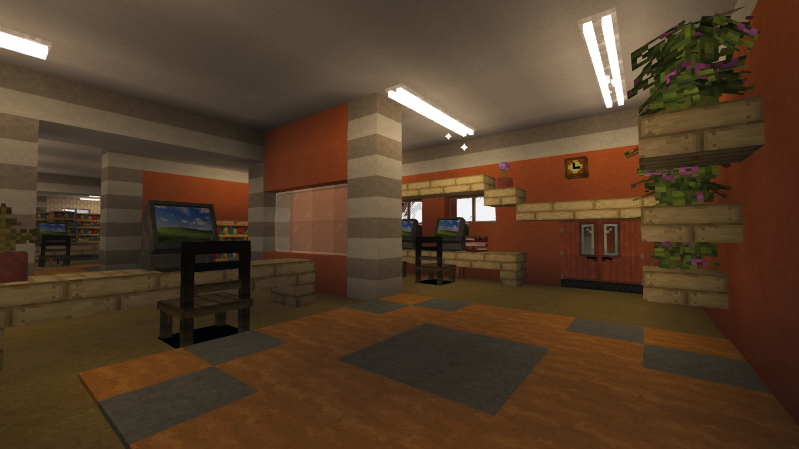
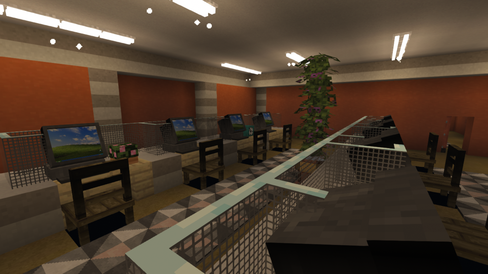
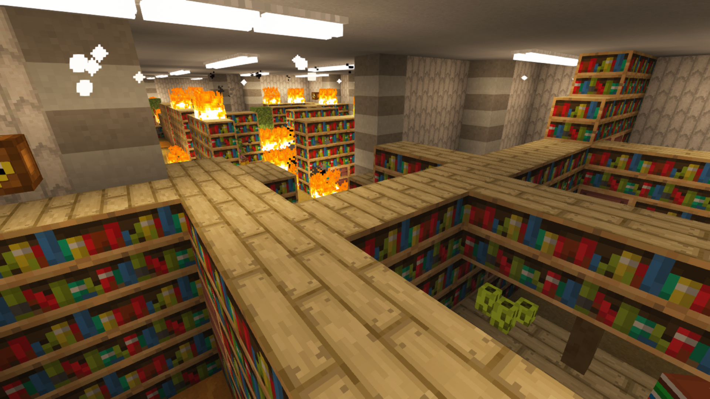

# Level 153: Vintage Office Building

## Description
This level is an office building, filled with vintage desks, computers, elevators, clocks, bookshelves etc. In there, you may occasionally find the headquarters of some colonies but there are no members around. There is a very small chance to come across a room with the Prime Book that is suspected of containing every secret of the backrooms, but cannot be deciphered.

  

## Entities
WIP

## Entrances
* Entering a portal in <a href="./Level_62.md">Level 62</a>.

## Exits
* Entering an elevator end gateway will lead to <a href="./Level_9223372036854775807.md">Level 9223372036854775807</a>.

<a href="./Level_62.md">< [Level 62]</a> | <a href="./Levels.md">Level List</a> | <a href="./Level_Level_9223372036854775807.md">[Level Level_9223372036854775807] ></a>
