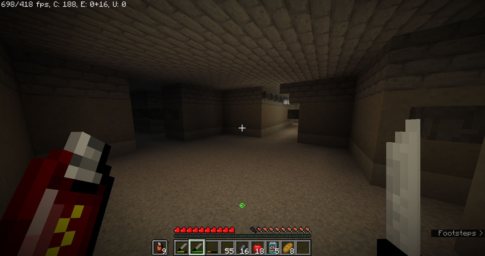
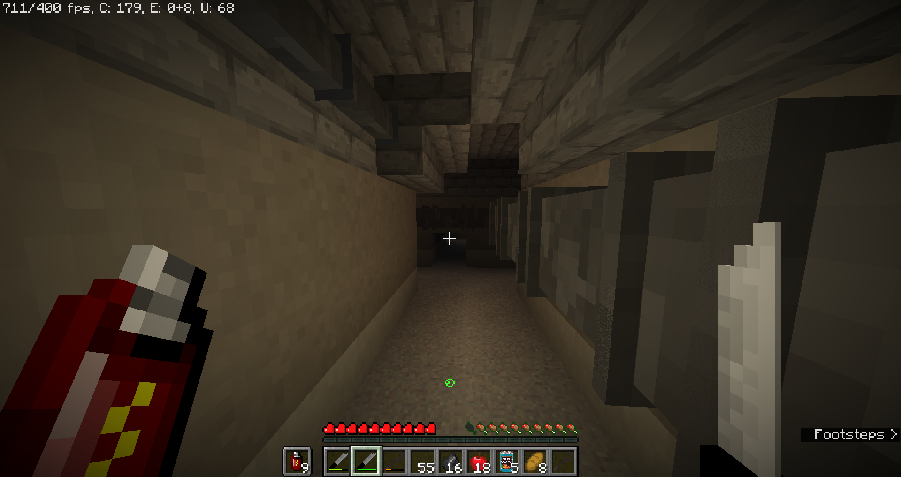
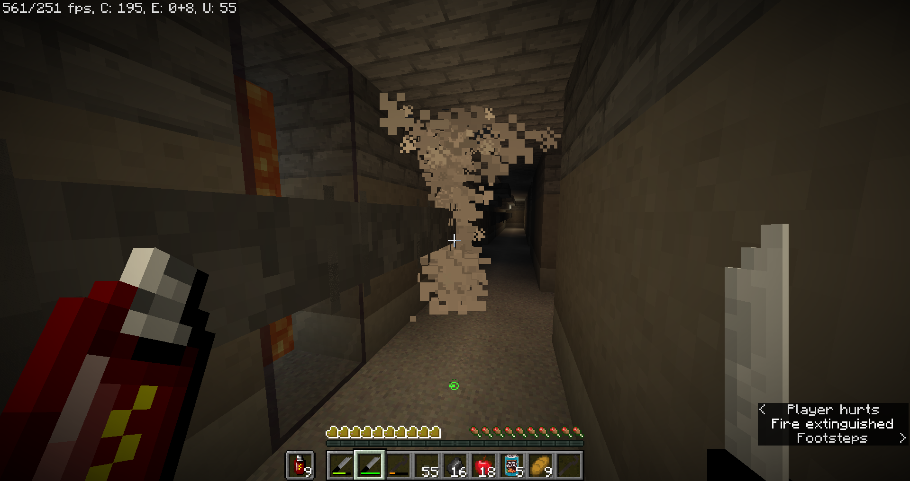

# Level 2: Pipe Dreams

## Description
This level has many long hallways with pipes running along the side. Currently it is unsure what is in the pipes, but what is known is that they can burst and give you poision when you walk next to them. 

## Entities
(WIP)

## Entrances
* Entering an end gateway portal in <a href="./Level_1.md">Level 1</a>.

## Exits
* Entering an end gateway portal will lead to <a href="./Level_3.md">Level 3</a>.
* Entering a portal at `X: 112 Z: -55` may lead to <a href="../hubs/Hub_1.md">Hub 1</a>.

<a href="./Level_1.md">< [Level 1]</a> | <a href="./Levels.md">Level List</a> | <a href="./Level_3.md">[Level 3] ></a>