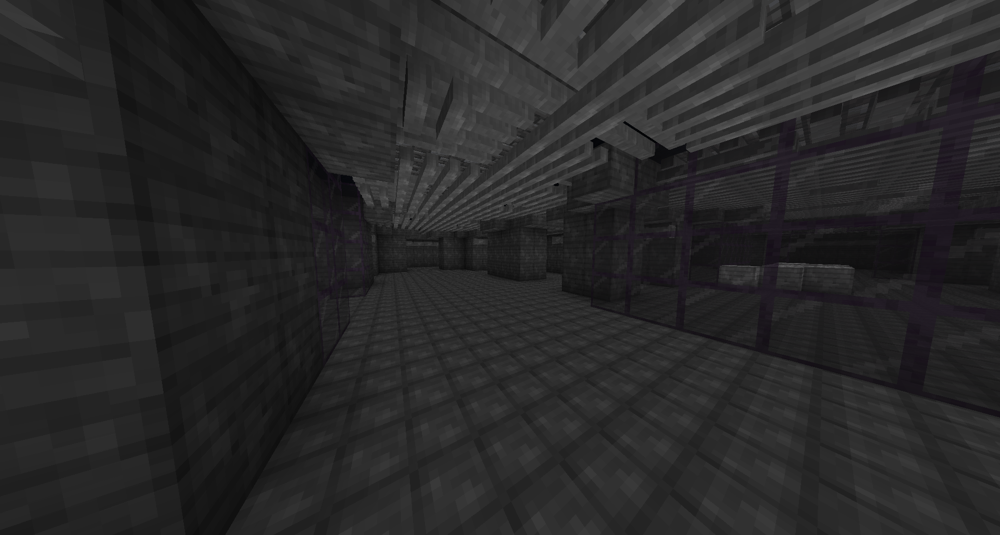
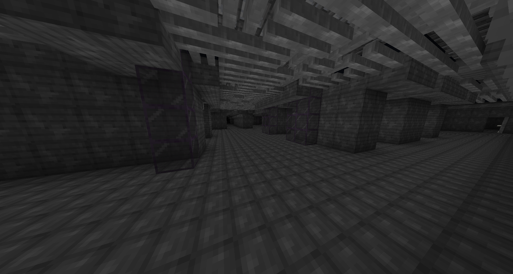

# Level 6: Lights Out

## Description
This level consists of dark hallways, with the only source of light being the flashlight provided to you when entering the level.

## Entrances
* Noclip from a boiler room in <a href="./Level_5.md">Level 5</a>.

## Exits
* Find a hole with a ladder in the floor, go down and you will be noclipped into <a href="./Level_7.md">Level 7</a>, or in rare occasions directly to <a href="./Level_8.md">Level 8</a>.
* Going through a portal at `X: 97 Z: -61` will lead to <a href="./Level_1.md">Level 1</a>.

<a href="./Level_5.md">< [Level 5]</a> | <a href="./Levels.md">Level List</a> | <a href="./Level_7.md">[Level 7] ></a>