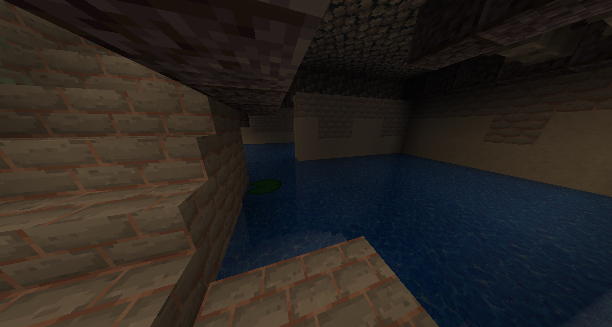
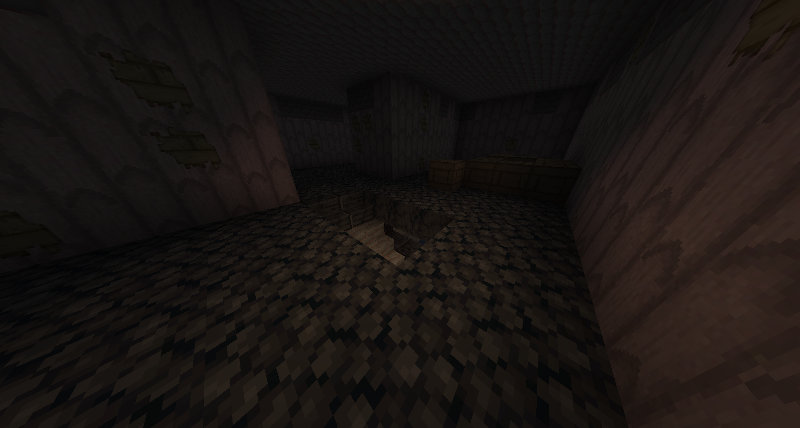
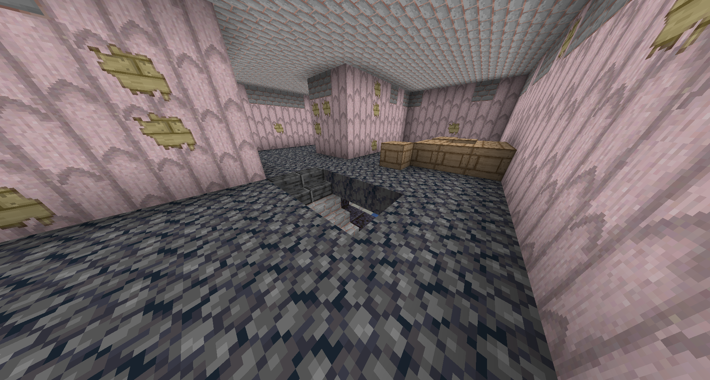

# Level 7: Thalassophobia

## Description
This level is split into 2 layers. The upper layer is hallways similar to the ones in Level 0, but the floor is basalt and the walls are pink. The layer underneath it, are hallways filled with water. You will find many supply crates on the upper layer.

## Entrances
* Noclip here by falling down a ladder in <a href="./Level_6.md">Level 6</a>.
* Go through a portal in <a href="./Level_4.md">Level 4</a> at `X: 112 Z: 23`.

## Exits
* Find a 5x5 hole and jump in it, you will get noclipped to <a href="./Level_8.md">Level 8</a>.
* Find a portal at `X: -2957 Z: 37`, enter it and you will land in <a href="./Level_4.md">Level 4</a>.

<a href="./Level_6.md">< [Level 6]</a> | <a href="./Levels.md">Level List</a> | <a href="./Level_8.md">[Level 8] ></a>