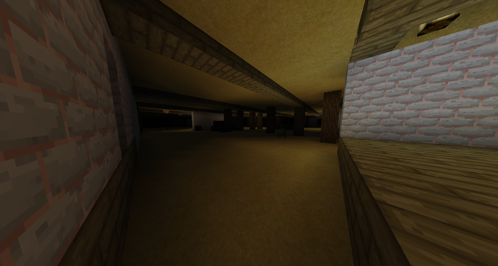
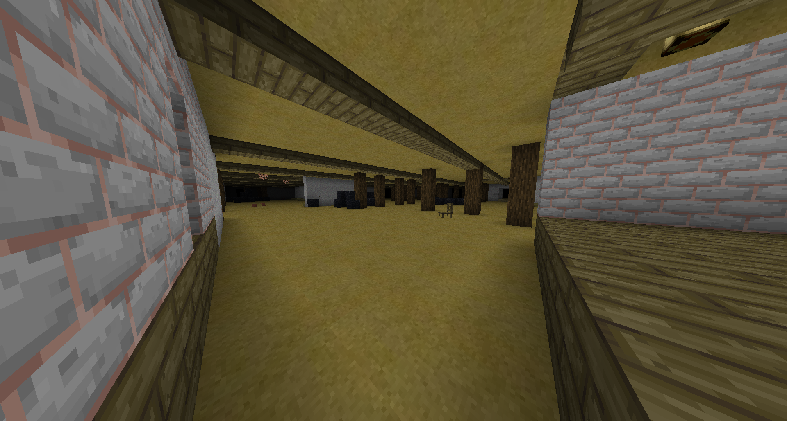
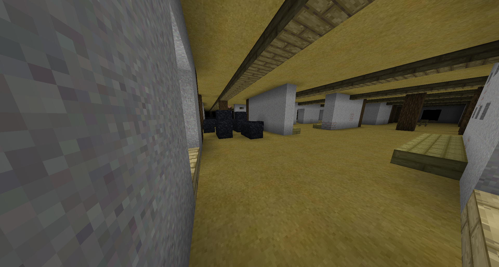

# Level 8: Attic

## Description
This level has multiple layers, but they all look like an old attic. You can find some loot crates in here. Some sections seem to be collapsed, but no collaps happened live so far. 

## Entities
(WIP)

## Entrances
* Jumping into a hole in <a href="./Level_7.md">Level 7</a>.
* Jumping into a hole in <a href="./Level_6.md">Level 6</a> sometimes leads to this level.

## Exits
* Entering an end gateway portal will lead to <a href="./Level_9.md">Level 9</a>.

<a href="./Level_7.md">< [Level 7]</a> | <a href="./Levels.md">Level List</a> | <a href="./Level_9.md">[Level 9] ></a>