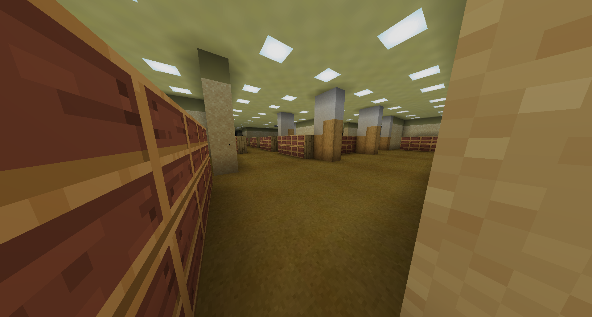

# Level End: The End

## Description
The End is a big library, with empty bookshelfs. 

## Entities
(WIP)

## Entrances
* INVALID: Entering an end gateway portal in <a href="./Level_62.md">Level 62</a>.
* Entering a portal in <a href="./Level_0.md">Level 0</a>.
* Entering a portal in <a href="./Level_8.md">Level 8</a>.

## Exits
* Entering a portal at `X: 9 Z: -13` may lead to <a href="./Level_0.md">Level 0</a>.

<a href="./Level_9223372036854775807.md">< [Level 9223372036854775807]</a> | <a href="./Levels.md">Level List</a>